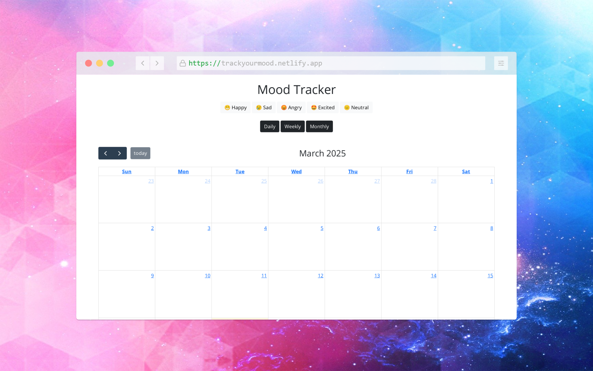

# 😃 Mood Tracker

A simple and elegant mood tracking web application built with **Vanilla JavaScript** and **Bootstrap**, featuring a **calendar view** powered by **FullCalendar.io**. Users can log their daily moods and visualize their emotional trends over time.

## 🌟 Features

- 📅 **Grid Calendar View** – Displays moods in daily, weekly, and monthly formats.
- 😀 **Mood Selection** – Choose from five different moods (Happy, Sad, Angry, Excited, Neutral).
- 💾 **Local Storage Support** – Moods are saved and persist across sessions.
- 🔄 **Interactive UI** – Smooth navigation between different time views.

## 📸 Screenshots



## Live Demo 👇

You can try the project live by clicking [here](https://trackyourmood.netlify.app/).

## 🚀 Installation

1. Clone the repository:
   ```sh
   git clone https://github.com/just-jatinverma/Mood-Tracker.git
   ```
2. Navigate into the project directory:
   ```sh
   cd Mood-Tracker
   ```
3. Open `index.html` in your browser.

## 🛠️ Technologies Used

- **HTML** – Structure of the web app
- **CSS & Bootstrap** – Styling and layout
- **JavaScript (Vanilla JS)** – Functionality
- **FullCalendar.io** – Calendar integration

## 🤝 Contributing

Feel free to submit a pull request or report issues in the repository.

## 📜 License

This project is licensed under the **MIT License**.

---

💡 _Track your mood and visualize your emotional journey!_
